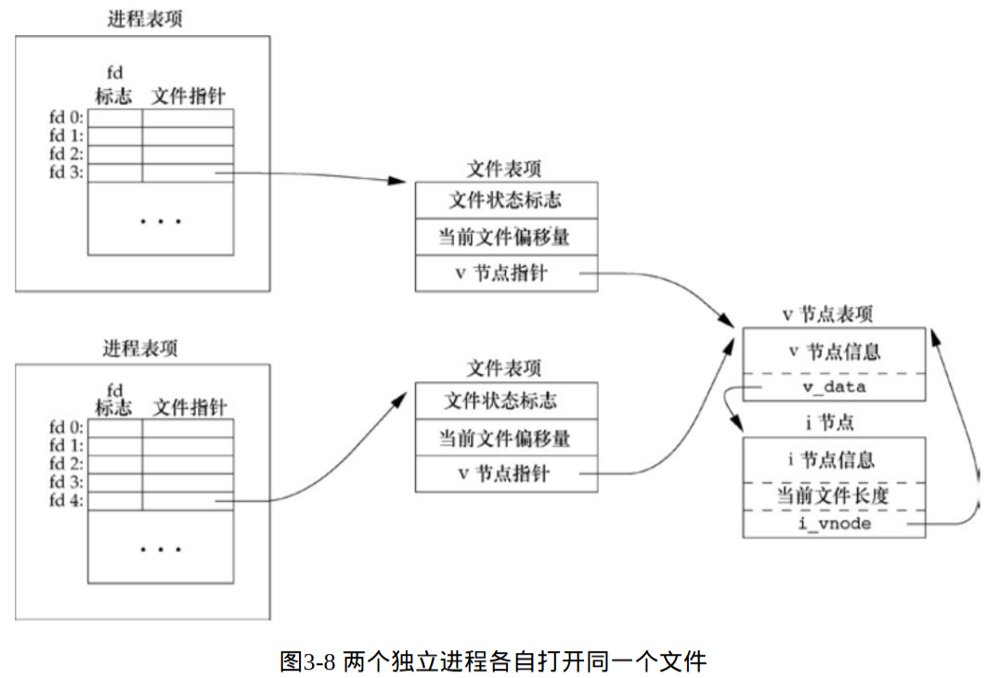
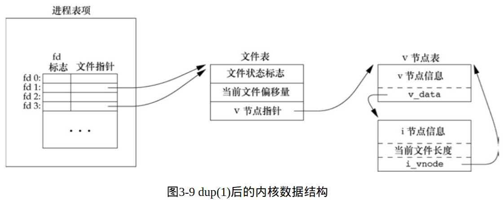

### 1.缓冲区实验
---
#### printf是行缓冲
- Input:
```c
    printf("Hello Linux");
    while(1) {
        sleep(1);
    } 
```
- Output:\


---
- Input:
```c
    printf("Hello Linux\n");
    while(1) {
        sleep(1);
    } 
```
- Output: \


---
#### 行缓冲溢出
- Input:
```c
    for(int i=0; i<500; i++)
        printf("%d", i);
    while(1) {
        sleep(1);
    } 
```
- Output: \

---